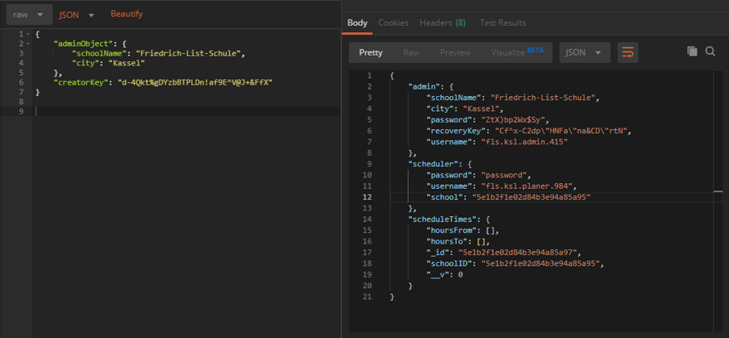
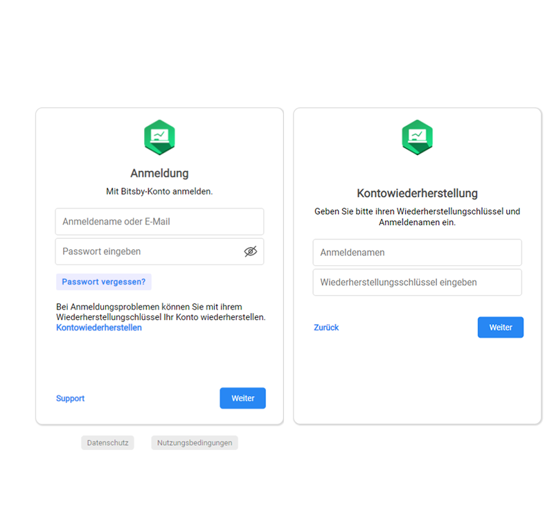
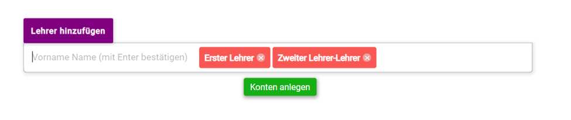
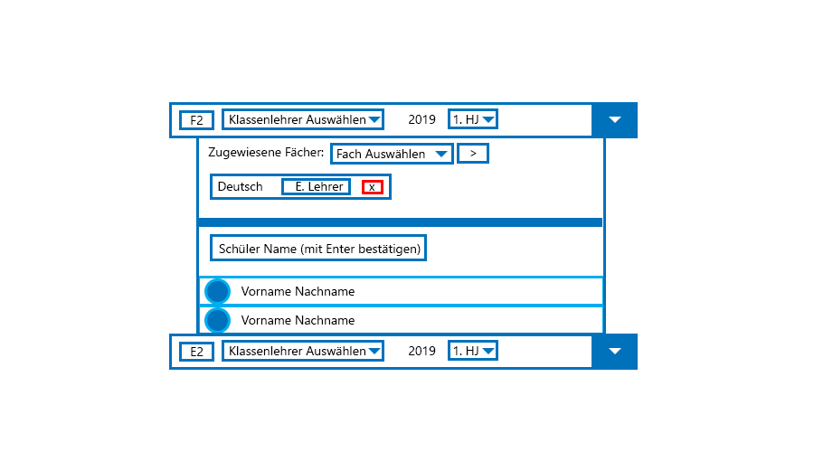
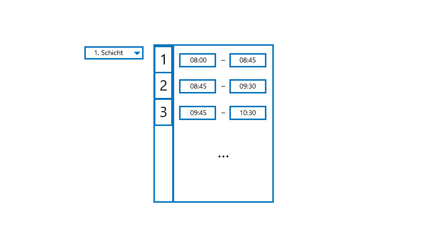
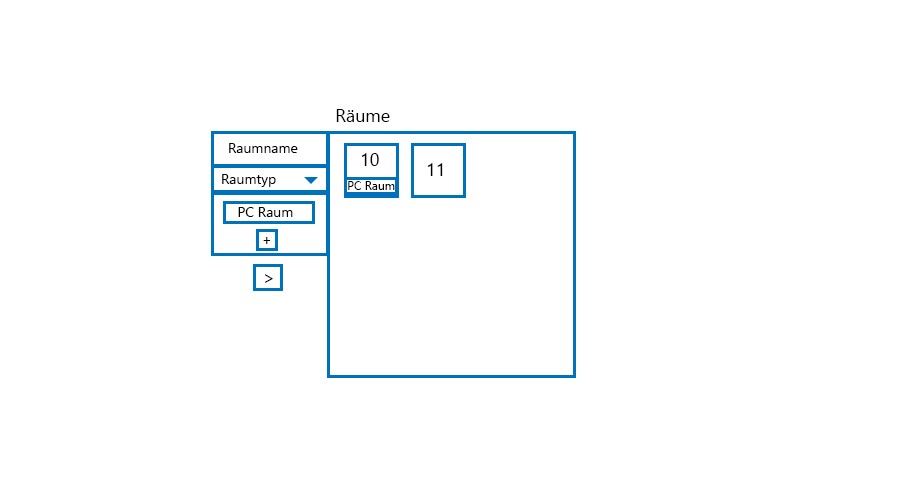
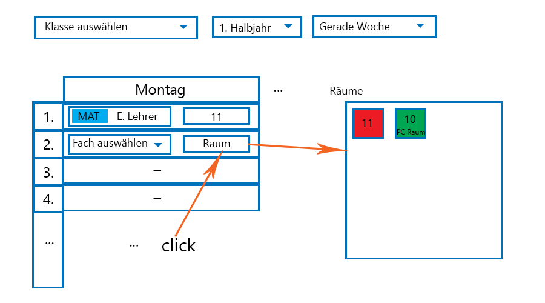
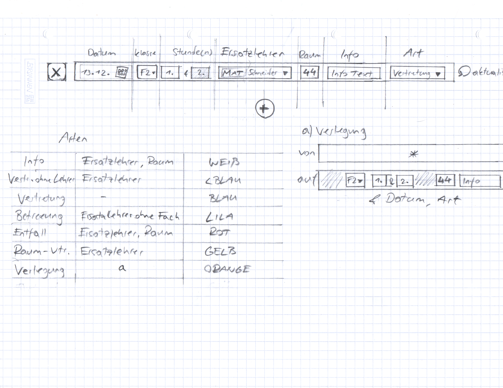
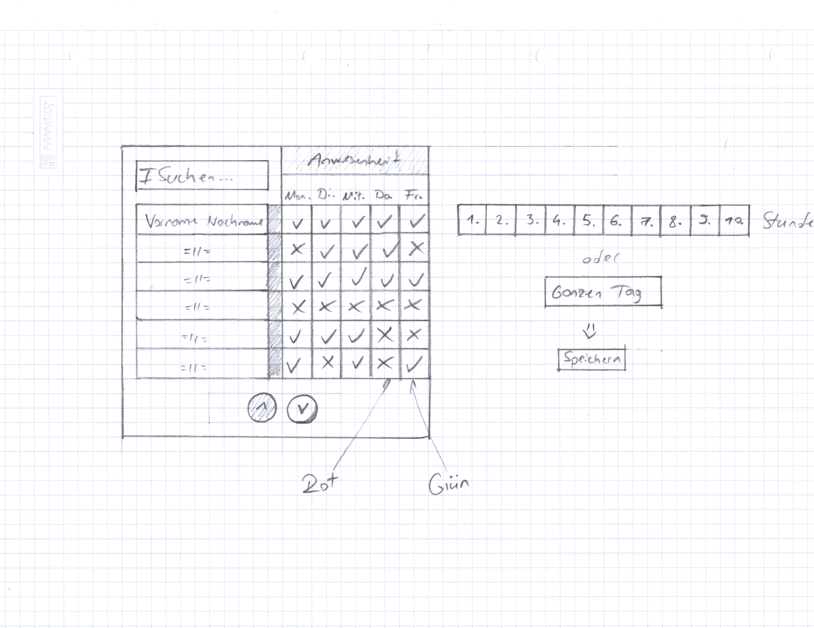
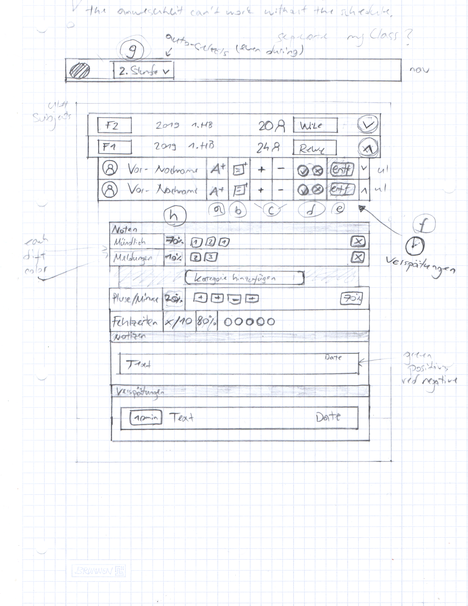

## ClassHero docs

# Kontoarten
1. Adminkonto (PC-only)
2. Planerkonto (PC-only)
3. Lehrerkonto (PC und Android/iOS/Windows Phone)
4. Schülerkonto (PC und Android/iOS/Windows Phone)
5. Elternteil Konto (PC und Android/iOS/Windows Phone)

# Anlegung einer Schule ins System

Um komplette Kontrolle und Sicherheit der Konten und Seite zu haben, werden die Konten per Postman von mir persönlich angelegt.

1. Name der Schule und die Stadt werden eingetragen, sowie der "creator key", der nötig ist um im Server ein Konto erstellen zu können.
   Zu dem Schlüssel habe nur ich Zugang. Bei POST an Server wird der Schlüssel gehasht.

    1.1 Aus den Parametern **Schule**, **Stadt** wird ein Admin Anmeldename, Admin Password, Admin Wiederherstellungsschlüssel und               Planer Anmeldename generiert, wie auch die Schule.
    
    1.2 Alle Anmeldenamen haben das Format: **{Schule}**.**{Stadt}**.**{Konto Typ}**.**{Zufällige 3-stellige Zahl}**. 
        
    1.3 Parameter Schule und Stadt werden für den Anmeldenamen automatisch abgekürzt (Friedrich-List-Schule wird zu fls, Kassel wird zu         ksl).
    
    

# Login

   
   
# Adminbereich

Beinhaltet 2 Komponenten: 
   **A)** Lehrerverwaltung
   **B)** Klassenverwaltung
   
   **A)** 

   1.0 Hier werden Lehrerkonten angelegt mit den Parametern (Vorname, Nachname) und bearbeitet.

   
   
   1.1 Hier kann man für Lehrer Fächer anlegen.
   
   1.2. **Keine Klasse** bedeutet zurzeit, dass der Lehrer kein Klassenlehrer ist.

   
   
   **B)**
   
   
   
   Erstens legt der Admin eine Klasse an mit dem Parameter **Klassenbezeichnung**

   1.0 Der Admin kann der Klasse einen Klassenlehrer zuweisen.
   
   1.1 Das Schuljahr und Halbjahr werden automatisch ausgewählt, können aber umgeändert werden.
   
   1.2 Fächer kann man der Klasse zuweisen.
   
   1.3 Schüler Konten legt man mit dem selben Prozess an, wie Lehrer konten. 
   
# Planerbereich

Beinhaltet 5 Komponenten:
   **A)** Stunden Dauer Verwaltung
   **B)** Raumverwaltung
   **C)** Statischer Stundenplan
   **D)** Vertretungen
   **E)** Lehreranwesenheit
      
      
   **A)**
      Hier trägt der Planer die Stunden Zeiten ein, i.e. die erste Schulstunde beginnt um z. B. 08:00 und endet zu 08:45 usw. und kann         zwischen der 1. und 2. Schicht auswählen.
      
   

   **B)** 
      Hier werden alle Räume eingetragen die zum Unterricht verfügbar sind und haben eine Standard Bezeichnung _leer_ (normaler Raum),         oder der Planer kann spezielle Bezeichnungen erstellen, wie z. B. "PC Raum", und kann es an Räume befestigen.
      
   
   
   **C)**
      Hier wählt der Planer die Klasse aus, das Halbjahr der Klasse und ob es die gerade oder ungerade Woche ist. Dannach kann man für         eine Stunde ein Fach auswählen und den Raum.
      
   

   **D)**
      Ich hoffe das Bild erklärt die Vertretungen. In der 2. Arten Spalte zeigt es welche inputs deaktiviert sind. Bei der Art                 "Betreuung" wird die Ersatzlehrer auswahl nur auf Lehrer bezogen, in jedem anderen Fall wählt man eigentlich Fächer (+automatisch       Fachlehrer).
   
   
      
   **E)**
      Dieses Bild sollte auch selbsterklärend sein. Man wählt drück bei einem Lehrer auf das z. B. Montag kästchen, und der Rest wird         Rechts angezeigt um die Anwesenheit an dem Tag zu verwalten. Diese Anwesenheit dient dazu um nicht alle Vertretungen manuell bei         bereich D eintragen zu müssen.

   
      
# Lehrerbereich

   Beinhaltet 3 Komponenten:
   **A)** Verwaltung der Fächer
   **B)** Klassenstundenpläne
   **C)** Lehrerstundenplan
   **D)** Verfügbare Räume
   **E)** Lehreranwesenheit
   
   **A) Verwaltung der Fächer**

   In diesem Bereich hat Lehrer eine Übersicht über alle Klassen die er Unterrichtet.
   
   

      auf Bild:

      g) Die jetzige Stunde wird per Stundenplan automatisch ausgewählt, kann aber manuell ausgewählt werden.
      a) Noteneintragung. !vergessen: Nach dem Namen des Schülers kann der Lehrer die Durschschnitts Note des Schüler in dem Fach sehen.
      b) Notizeneintragung: Können als Positiv, Negativ oder Neutral kategorisch eingetragen werden.
      c) Pluse/Minuse.
      d) Anwesenheit für die Stunde. Wenn es sich um eine Doppelstunde handelt, wird es automatisch übernommen, kann aber umgeändert werden.
      e) Schüler vom Fach entfernen. Das kann man machen, weil bei der Schülerkontenerstellung an jedes Fach automatisch alle    Schüler von der Klasse eingefügt werden.
      f) Verspätungen.
      h) Notengewichtung: Jeder Lehrer kann anpassen, wie viel Noten, Pluse/Minuse, Meldungen die Gesamtnote des Fachs beinflussen. Bei der Änderung bei einem Schüler, wird es automatisch für jeden Schüler in dem Fach aufgenommen. Bei Noten kann man mehrere Notenkategorien machen und jeder eine Gewichtung zuweisen, wie z. B. Test (30%), Klausur (40%), Lektüre (25%) usw.. Das kann man auf dem Bild nicht sehen.

      Der letze Bereich dient dazu eine Übersicht über Schüler in dem Fach zu sehen. 
      Der Klassenlehrer kann von seiner Klasse alles sehen, wie auch Gesamtergebnisse aller Fächer.
      
  **B)** Hier kann der Lehrer, den Stundenplan von jeder Klasse sehen, den statischen, wie auch den dynamischen. Der dynamische ist wie der statische, er ist aber durch Lehreranwsenheit und Vertretungen umgeändert.
  
  **C)** Hier kann der Lehrer seinen eigenen Stundenplan sehen, der durch alle statische Stundenpläne aller Klassen entsteht.
  
  **D)** Hier kann der Lehrer überprüfen, und sehen welche Räume frei oder besetzt sind.

  **E)** Hier kann der Lehrer die Anwseneheit aller anderer Lehrer sehen, und in welchem Raum sie gerade sind.
  
  Noch weiß ich leider nicht, wie genau ein System aufbauen könnte das Automatisch die Ent-Noten ergibbt, bei FOS und anderen       Kategorien.
     
# Schülerbereich
   Beinhaltet 6 Komponenten:
   
   A) Statischer Stundenplan der Klasse
   B) Dynamischer Stundenplan der Klasse (der durch Vertetungen und Lehreranwesenheit entsteht)
   C) Noten und andere Statistiken in allen Fächern
   D) Seine Anwesenheit in jedem Fach, und generäll
   E) Entschuldigung senden

# Elternbereich

   A) Noten des Schülers
   B) Anwesenheit des Schülers
   C) Kann eine Termin Nachfrage zu einem Lehrer senden

## Chat

   ### Planer, Lehrer, Schüler haben einen Chat. Somit können sie zur jeder Zeit mit einander kommunizieren. 
   
   Ein Lehrer kann Nachrichten an Fächer schicken, wo automatisch jeder Schüler benachrichtigt wird. 
   Datein können über den Chat gesendet werden, aber werden nach dem öffnen, oder nach 2 Wochen dem Versandt von der Datenbank gelöscht,    und weiterhin über den Lokale Speicher des PCs oder Smartphones geöffnet.
   Schüler, Lehrer und Planer können sich gegenseitig kontaktieren.
   Jede Klasse hat auch einen eigenen Chat.

# Benachritigungen (dies ist eine Komponente, wie auch eine Smartphone Push-Benachritigung)

   Lehrer bekommen Benachritigungen über Alle Stundenplan änderungen und Vertretungen, Entschuldigungen, Terminanfragen.
   
   Schüler bekommen Benachritigungen über Alle Stundenplan änderungen und Vertretungen, Noten, Stundenplan änderungen.
