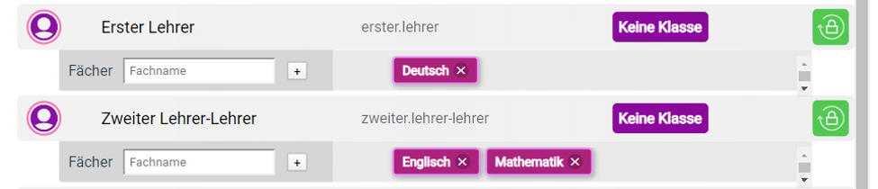

## ClassHero docs

# Kontoarten
1. Adminkonto (PC-only)
2. Planerkonto (PC-only)
3. Lehrerkonto (PC und Android/iOS/Windows Phone)
4. Studentenkonto (PC und Android/iOS/Windows Phone)
5. Elternteil Konto (PC und Android/iOS/Windows Phone)

# Anlegung einer Schule ins System

Um komplette Kontrolle und Sicherheit der Konten und Seite zu haben, werden die Konten per Postman von mir persönlich angelegt.

1. Name der Schule und die Stadt werden eingetragen, sowie der "creator key", der nötig ist um im Server ein Konto erstellen zu können.
   Zu dem Schlüssel habe nur ich Zugang. Bei POST an Server wird der Schlüssel gehasht.

    1.1 Aus den Parametern **Schule**, **Stadt** wird ein Admin Anmeldename, Admin Password, Admin Wiederherstellungsschlüssel und               Planer Anmeldename generiert, wie auch die Schule.
    
    1.2 Alle Anmeldenamen haben das Format: **{Schule}**.**{Stadt}**.**{Konto Typ}**.**{Zufällige 3-stellige Zahl}**. 
        
    1.3 Parameter Schule und Stadt werden für den Anmeldenamen automatisch abgekürzt (Friedrich-List-Schule wird zu fls, Kassel wird zu         ksl).
    
    

# Login

   
   
# Adminbereich

Beinhaltet 2 Komponenten: 
   **A)** Lehrerverwaltung
   **B)** Klassenverwaltung
   
   **A)** 

   1.0 Hier werden Lehrerkonten angelegt mit den Parametern (Vorname, Nachname) und bearbeitet.

   
   
   1.1 Hier kann man für Lehrer Fächer anlegen.
   
   1.2. **Keine Klasse** bedeutet zurzeit, dass der Lehrer kein Klassenlehrer ist.

   
   
   **B)**
   
# Planerbereich

Beinhaltet 4 Komponenten:
   A) Stunden Dauer Verwaltung
   B) Raumverwaltung
      
      
   A)
      Hier trägt der Planer die Stunden Zeiten ein, i.e. die erste Schulstunde beginnt um z. B. 08:00 und endet zu 08:45 usw.
      
      [Image]

   B) 
      Hier werden alle Räume eingetragen die zum Unterricht verfügbar sind und haben eine Standard Bezeichnung _leer_ (normaler Raum),         oder der Planer kann spezielle Bezeichnungen erstellen, wie z. B. "PC Raum", und kann es an Räume befestigen.
   

